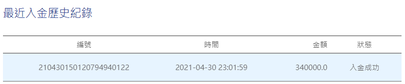

# 加密貨幣交易所買賣教學

主要加密貨幣買賣都在\[幣安\]\(Binance\)交易所，至於台灣也有加密貨幣交易所，如MAX或BitoPro\)，**為何要選擇在\[幣安\]交易所做買賣?**因為幣安目前是全球最大交易所，且**支援多幣種**&**流動性較好，**故選在**\[幣安\]交易所買賣加密貨幣!**

首先，您要先註冊帳號!



**緊接著，是在\[幣安交易所\]購買加密貨幣前要先"入金"。**  
因為考量到未來會將"加密貨幣"換成台幣，所以我先在**台灣加密貨幣交易所MAX進行註冊開戶，再透過台灣加密貨幣交易所MAX購買USDT轉至幣安\(Binance\)交易所。**



## **\[流程步驟\]**

**以下介紹我的入金、買賣加密貨幣流程，前提要先在幣安、MAX等交易所，註冊開戶完成。  
MAX交易所需綁定國內銀行帳戶，並且透過該國內銀行帳戶將新台幣入金至MAX交易所。**

### **\[1.新台幣入金至MAX交易所\]**

國內銀行綁定後，利用該國內銀行轉帳至"遠銀受託現代財富科技信託財產專戶（ＭＡＸ）"，轉帳成功後，MAX交易所將會看到你所入金的金額。

### \[2.MAX交易所購買USDT\]

USDT，定義為加密貨幣裡的美金穩定幣。  

### \[3.USDT轉帳至幣安交易所\]

#### \(1\)因要從MAX轉帳至幣安，所以先至幣安查詢轉帳地址。

#### 幣安交易所點選，錢包-&gt;現貨錢包

#### \(2\)在USDT選擇**"充值"**。

#### \(3\)選擇TRC20，將"地址"複製，接著從MAX交易所進行轉帳，您的幣安交易所就會看到你所轉帳的USDT。 

#### ※圖片上地址是我的，記得開啟你的幣安交易所查詢地址。 ※此地址只可接收USDT ，請不要向這個地址充值除 USDT 之外的資產，任何充入此地址的其他資產將不可找回。

#### \(4\)MAX交易所轉帳至幣安交易所

在MAX交易所選擇**"USDT-&gt;提領"。  
將幣安交易所第\(3\)點所提到的地址，新增上去，按下提交後，約等待1~2分鐘，您的幣安交易所將會看你所轉帳的USDT。**

\(5\)至幣安交易所，查詢USDT是否收到。

### \[4.幣安交易所買賣加密貨幣\]

資金到位後，就可以開始買賣加密貨幣。  
我以BTC\(比特幣\)作為舉例，以58479.77購買0.1BTC，所花費金額為5847.977USDT。

